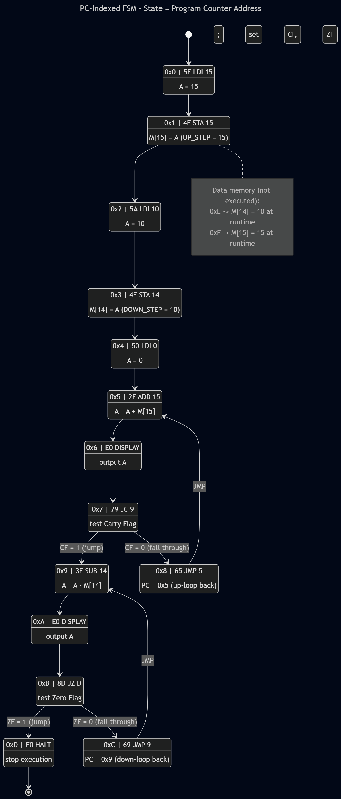
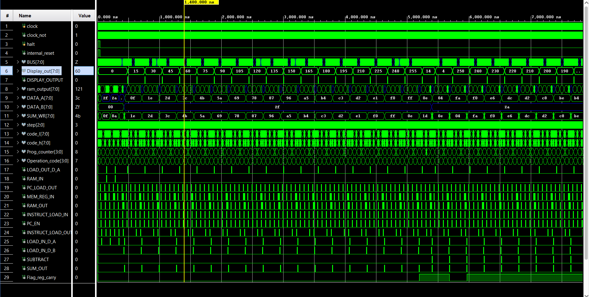
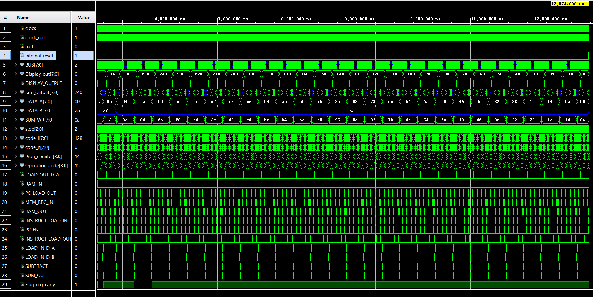

# 8‑Bit Microcoded Computer (Verilog RTL)


A complete, bus‑oriented **8‑bit von Neumann computer** described in Verilog. The
datapath, control, ALU, RAM, program counter and step sequencer are all RTL
modules; the control logic is **microcoded**, driven by a microcode ROM
(`microcode_control`) whose contents are defined by the Python tables
`MICROCODE_0 … MICROCODE_3`.

The design supports register/memory arithmetic with **carry and zero flags** and
**conditional branches** (`JC`, `JZ`) implemented as four flag‑selected microcode
banks.

> **Source of truth.** This README is written from the RTL (`circuit`) and the
> microcode arrays. Where the earlier prose specification disagreed with the
> code, the code wins — see [§12 Accuracy Notes](#12-accuracy-notes).

---

## Table of Contents

1. [Features](#1-features)
2. [Architecture](#2-architecture)
3. [Repository Layout](#3-repository-layout)
4. [Control Word & Signal Decode](#4-control-word--signal-decode)
5. [Microcode ROM (LUT / EEPROM)](#5-microcode-rom-lut--eeprom)
6. [Flag‑Selected Banks: `MICROCODE_0…3`](#6-flag-selected-banks-microcode_03)
7. [Instruction Set Architecture](#7-instruction-set-architecture)
8. [Per‑Instruction Microcode](#8-per-instruction-microcode)
9. [Flags & Sequencing](#9-flags--sequencing)
10. [Module Reference](#10-module-reference)
11. [Example Program](#11-example-program)
12. [Accuracy Notes](#12-accuracy-notes)
13. [Simulation](#13-simulation)


---

## 1. Features

| Property | Value |
| :--- | :--- |
| Architecture | 8‑bit, single shared bus, von Neumann (unified RAM) |
| Data bus width | 8 bits (`BUS_PORT[7:0]`) |
| Address bus width | 4 bits (low nibble of the bus, `BUS_PORT[3:0]`) |
| RAM | 16 words × 8 bits = **128 bits** |
| RAM address range | `0x0 … 0xF` |
| Instruction format | `[7:4]` opcode, `[3:0]` operand |
| Microcode word | 16 control bits (split into `control_h` / `control_l`) |
| Micro‑steps | 8 per instruction (`step[2:0]`, 0–7) |
| Microcode banks | 4 (`MICROCODE_0…3`), selected by `{Flag_zero, Flag_carry}` |
| ALU | 8‑bit add / subtract (2’s‑complement), carry out |
| Status flags | Carry (`Flag_reg_carry`), Zero (`Flag_reg_zero`) |
| Control | Microcoded; one tristate driver on the bus per micro‑step |

---

## 2. Architecture

All modules communicate over a single tristate bus, `BUS_PORT`. At most one
buffer is enabled per micro‑step. The low nibble `BUS_PORT[3:0]` carries
addresses/operands (PC and IR operand); the full byte carries data.

```
                         ┌───────────────────────────── BUS_PORT[7:0] ─────────────────────────────┐    
                         │                                                                          │
        ┌──────────┐     │   ┌──────────┐   ┌──────────┐   ┌──────────────┐   ┌──────────────┐      │
  CLK ─▶│   STEP   │     ├──▶│  Reg A   │──▶│   ALU    │──▶│  Reg B (in)  │   │     RAM      │◀────▶│
        │ (3-bit,  │     │   │ data_reg │   │ ALU_SUM  │   │  data_reg    │   │ 16×8 + MAR   │      │
        │  ~CLK)   │     │   └────┬─────┘   │ A±B,Cout │   └──────────────┘   └──────┬───────┘      │
        └────┬─────┘     │        │buf A    └────┬─────┘                            buf RAM         │
             │ step      │     LOAD_OUT_D_A   SUM_OUT                                                │
             ▼           │                                                                          │
        ┌──────────────┐ │   ┌──────────┐   ┌──────────────┐   ┌──────────────┐                     │
 OP ───▶│  microcode   │ ├──▶│  Instr   │──▶│ PC (4-bit)   │──▶│   DISP_OUT   │                     │
 flags ▶│  _control    │ │   │ Register │   │ program_     │   │ (display reg)│                     │
        │ (LUT/EEPROM) │ │   │ +operand │   │ counter      │   └──────────────┘                     │
        └──────┬───────┘ │   └────┬─────┘   └──────┬───────┘                                         │
        control_h/l      │     INSTRUCT_   PC_LOAD_OUT / JUMP_PC                                      │
               │         │     LOAD_OUT (operand → bus[3:0])                                          │
               └─────────┴──── decoded control signals ───────────────────────────────────────────┘
```

**Bus discipline (enforced by the microcode):**

- Exactly one of `LOAD_OUT_D_A`, `SUM_OUT`, `RAM_OUT`, `PC_LOAD_OUT`,
  `INSTRUCT_LOAD_OUT` may be asserted in any micro‑step.
- `RAM_IN` and `RAM_OUT` are never asserted together.
- Register B has **no bus driver** — it is a dedicated ALU input only.

---

## 3. Repository Layout

> Filenames below are the conventional layout for this design; module names are
> taken verbatim from the Verilog.

```
.

│   ├── circuit.v                       # top module (datapath + control wiring)
│   ├── microcode_control.v             # microcode ROM (LUT/EEPROM): OP+step+flags → control_h/l
│   ├── data_register.v                 # 8-bit load-enable register (Reg A, Reg B, IR)
│   ├── ALU_SUM.v                       # 8-bit adder/subtractor with carry out
│   ├── zero_flag.v                     # zero detect on ALU result
│   ├── RAM_4b_adrs_8b_wrd_gates.v      # 16×8 RAM with integrated MAR
│   ├── program_counter.v               # 4-bit PC (enable + jump-load)
│   ├── buffer_8bit.v                   # 8-bit tristate bus buffer
│   ├── buffer_4bit.v                   # 4-bit tristate bus buffer
│   └── STEP.v                          # 3-bit step counter (clocked on ~CLK)
├── microcode/
│   └── microcode.py                    # MICROCODE_0..3 + signal definitions / ROM generator
└── sim/
    └── tb_circuit.v                    # testbench (not included in provided sources)
```

---

## 4. Control Word & Signal Decode

The microcode word is 16 bits, delivered to the datapath as two bytes,
`control_h` (high) and `control_l` (low). The top module decodes them exactly as
follows.

**Low byte — `control_l`:**

| Bit | Verilog net | Function |
| :---: | :--- | :--- |
| `control_l[7]` | `feedback_rst` | Microcode‑driven internal reset (`internal_reset = feedback_rst \| RESET`) |
| `control_l[6]` | `MEM_REG_IN` | Latch address into MAR (inside RAM) |
| `control_l[5]` | `RAM_IN` | Write bus → RAM |
| `control_l[4]` | `RAM_OUT` | Drive RAM → bus |
| `control_l[3]` | `INSTRUCT_LOAD_OUT` | Drive IR operand `[3:0]` → bus |
| `control_l[2]` | `INSTRUCT_LOAD_IN` | Latch bus → IR |
| `control_l[1]` | `LOAD_IN_D_A` | Latch bus → Reg A |
| `control_l[0]` | `LOAD_OUT_D_A` | Drive Reg A → bus |

**High byte — `control_h`:**

| Bit | Verilog net | Function |
| :---: | :--- | :--- |
| `control_h[7]` | `SUM_OUT` | Drive ALU result → bus |
| `control_h[6]` | `SUBTRACT` | ALU mode: 0 = add, 1 = subtract |
| `control_h[5]` | `LOAD_IN_D_B` | Latch bus → Reg B |
| `control_h[4]` | `flag_en` | Latch carry & zero flags |
| `control_h[3]` | `PC_EN` | Increment PC |
| `control_h[2]` | `PC_LOAD_OUT` | Drive PC → bus |
| `control_h[1]` | `JUMP_PC` | Load PC from bus (jump) |
| `control_h[0]` | `DISPLAY_OUTPUT` | Latch bus → `DISP_OUT` |

### Symbolic ↔ RTL cross‑reference

The microprogram (`microcode.py`) is written with symbolic signal names. Their
**functional** correspondence to the RTL nets is:

| Microcode symbol | RTL net | Microcode symbol | RTL net |
| :--- | :--- | :--- | :--- |
| `pc_counter_out` | `PC_LOAD_OUT` | `load_b_in` | `LOAD_IN_D_B` |
| `pc_counter_en` | `PC_EN` | `sum_out` | `SUM_OUT` |
| `pc_counter_jump` | `JUMP_PC` | `subtract` | `SUBTRACT` |
| `mem_in` | `MEM_REG_IN` | `flags_in_carry` | `flag_en` |
| `ram_in` | `RAM_IN` | `display_d_in` | `DISPLAY_OUTPUT` |
| `ram_out` | `RAM_OUT` | `halt` | `feedback_rst` *(see note)* |
| `instruct_in` | `INSTRUCT_LOAD_IN` | `load_a_in` | `LOAD_IN_D_A` |
| `instruct_out` | `INSTRUCT_LOAD_OUT` | `load_a_out` | `LOAD_OUT_D_A` |

> **Note on bit numbering.** `microcode.py` and the RTL use *independent* bit
> numbering for the 16‑bit word (e.g. the Python definitions place `halt` at the
> MSB, while the RTL decodes `feedback_rst` from `control_l[7]`). The
> `microcode_control` LUT is responsible for emitting the exact
> `control_h`/`control_l` pattern the datapath expects. The table above maps the
> two by **function**. The top‑level snippet decodes no separate `halt` net; the
> `HLT` micro‑step asserts the top low‑byte bit (`feedback_rst` / internal
> reset), which is the mechanism used to stop instruction progress — verify
> against `microcode_control.v` if you change the encoding.

---

## 5. Microcode ROM (LUT / EEPROM)

`microcode_control` is the control store. Conceptually it is addressed by:

```
address = { Flag_zero, Flag_carry, OP_CODE[3:0], step[2:0] }   // 9 bits → 512 entries
```

- `OP_CODE[3:0]` — opcode from the instruction register
- `step[2:0]` — current micro‑step (0–7)
- `{Flag_zero, Flag_carry}` — selects one of four banks (`MICROCODE_0…3`)

Each entry is a 16‑bit control word. In a discrete (EEPROM) build this is two
8‑bit ROMs (one for `control_h`, one for `control_l`). In RTL it is the
`microcode_control` module.

Every opcode begins with the same two‑step **fetch**:

```
step 0:  pc_counter_out | mem_in                 # PC → MAR
step 1:  ram_out | instruct_in | pc_counter_en   # RAM[PC] → IR, PC++
```

Steps 2–7 are the per‑instruction **execute** phase. Unused tail steps are `0`.

---

## 6. Flag‑Selected Banks: `MICROCODE_0…3`

The four banks are **identical** for every opcode *except* the two conditional
jumps. The bank is chosen by the current flag state:

| Bank | `Flag_zero` | `Flag_carry` | `JC` (0111) taken? | `JZ` (1000) taken? |
| :--- | :---: | :---: | :---: | :---: |
| `MICROCODE_0` | 0 | 0 | no | no |
| `MICROCODE_1` | 0 | 1 | **yes** | no |
| `MICROCODE_2` | 1 | 0 | no | **yes** |
| `MICROCODE_3` | 1 | 1 | **yes** | **yes** |

> Selection index = `{Flag_zero, Flag_carry}` (zero = MSB, carry = LSB).

A **taken** conditional jump uses the same micro‑step as an unconditional jump:

```
step 2:  instruct_out | pc_counter_jump          # operand → PC
```

A **not‑taken** conditional jump has `step 2 = 0`, so it falls through to the
next sequential instruction (the PC was already incremented during fetch).

This is how branching is realized without a dedicated branch‑condition mux: the
flags pick the bank, and the bank either contains the jump micro‑step or doesn’t.

---

## 7. Instruction Set Architecture

Instruction word: `[7:4]` opcode, `[3:0]` operand (4‑bit address or immediate).

| Opcode | Mnemonic | Operand | Effect | Steps |
| :---: | :--- | :--- | :--- | :---: |
| `0000` | `NOP` | — | PC ← PC+1 | 0–1 |
| `0001` | `LDA` | addr | A ← RAM[addr] | 0–3 |
| `0010` | `ADD` | addr | B ← RAM[addr]; A ← A+B; set CF, ZF | 0–4 |
| `0011` | `SUB` | addr | B ← RAM[addr]; A ← A−B; set CF, ZF | 0–4 |
| `0100` | `STA` | addr | RAM[addr] ← A | 0–3 |
| `0101` | `LDI` | imm | A ← operand (4‑bit immediate) | 0–2 |
| `0110` | `JMP` | addr | PC ← operand | 0–2 |
| `0111` | `JC` | addr | if CF: PC ← operand | 0–2 |
| `1000` | `JZ` | addr | if ZF: PC ← operand | 0–2 |
| `1001`–`1101` | *unused* | — | PC ← PC+1 (fetch only) | 0–1 |
| `1110` | `OUT` | — | DISP_OUT ← A | 0–2 |
| `1111` | `HLT` | — | stop instruction progress | 0–2 |

> `JC` (`0111`) and `JZ` (`1000`) **are implemented** via the flag‑selected
> banks — they are not “unused”. `ADD`/`SUB` update both flags.

---

## 8. Per‑Instruction Microcode

Symbolic control words per micro‑step (steps not shown are `0`):

| Opcode | S0 | S1 | S2 | S3 | S4 |
| :--- | :--- | :--- | :--- | :--- | :--- |
| `NOP` | `pc_out\|mem_in` | `ram_out\|instr_in\|pc_en` | — | — | — |
| `LDA` | `pc_out\|mem_in` | `ram_out\|instr_in\|pc_en` | `instr_out\|mem_in` | `ram_out\|load_a_in` | — |
| `ADD` | `pc_out\|mem_in` | `ram_out\|instr_in\|pc_en` | `instr_out\|mem_in` | `ram_out\|load_b_in` | `sum_out\|load_a_in\|flags_in` |
| `SUB` | `pc_out\|mem_in` | `ram_out\|instr_in\|pc_en` | `instr_out\|mem_in` | `ram_out\|load_b_in` | `sum_out\|load_a_in\|subtract\|flags_in` |
| `STA` | `pc_out\|mem_in` | `ram_out\|instr_in\|pc_en` | `instr_out\|mem_in` | `ram_in\|load_a_out` | — |
| `LDI` | `pc_out\|mem_in` | `ram_out\|instr_in\|pc_en` | `instr_out\|load_a_in` | — | — |
| `JMP` | `pc_out\|mem_in` | `ram_out\|instr_in\|pc_en` | `instr_out\|pc_jump` | — | — |
| `JC` † | `pc_out\|mem_in` | `ram_out\|instr_in\|pc_en` | `instr_out\|pc_jump` *(if CF)* / `0` | — | — |
| `JZ` † | `pc_out\|mem_in` | `ram_out\|instr_in\|pc_en` | `instr_out\|pc_jump` *(if ZF)* / `0` | — | — |
| `OUT` | `pc_out\|mem_in` | `ram_out\|instr_in\|pc_en` | `load_a_out\|display_d_in` | — | — |
| `HLT` | `pc_out\|mem_in` | `ram_out\|instr_in\|pc_en` | `halt` | — | — |

† S2 of `JC`/`JZ` is filled in or blank depending on the active bank (see §6).

Abbreviations: `pc_out`=`pc_counter_out`, `pc_en`=`pc_counter_en`,
`pc_jump`=`pc_counter_jump`, `instr_in`=`instruct_in`, `instr_out`=`instruct_out`,
`flags_in`=`flags_in_carry`.

---

## 9. Flags & Sequencing

**ALU.** `ALU_SUM` computes `A + B` or `A − B` (`A + ~B + 1`, 2’s complement)
based on `SUBTRACT`, producing `SUM_WR[7:0]` and carry `ALU_CARRY_OUT`. The ALU
is purely combinational — results are captured by Reg A via `LOAD_IN_D_A`.

**Flags.** Both flag registers update only when `flag_en` (`flags_in_carry`) is
asserted — i.e. on the final step of `ADD`/`SUB`:

- `Flag_reg_carry ← ALU_CARRY_OUT`
- `Flag_reg_zero ← zero_flag_en` (asserted when `SUM_WR == 0`, from `zero_flag`)

Both reset to 0 on `RESET`. They persist until the next `ADD`/`SUB`, so a `JC`/`JZ`
following arithmetic reads the freshly latched condition.

**Step counter.** `STEP` is a 3‑bit counter clocked on `~CLK` (`clock_not`), so
control signals settle half a cycle before the datapath’s rising‑edge captures.
It rolls 0→7; the microprogram leaves unused steps as `0` (idle) until the next
fetch.

**Reset path.** `internal_reset = feedback_rst | RESET`. The microcode can assert
`feedback_rst` (top low‑byte bit) to force the internal reset line.

---

## 10. Module Reference

| Module | Role | Key ports |
| :--- | :--- | :--- |
| `circuit` | Top: datapath + control decode + bus wiring | `CLK`, `RESET`, `BUS_PORT`, `DISP_OUT`, flag/step/opcode observ. outputs |
| `microcode_control` | Microcode ROM (LUT/EEPROM) | in: `OP_CODE`, `step`, `Flag_reg_carry`, `Flag_reg_zero` → out: `control_l`, `control_h` |
| `data_register` | 8‑bit load‑enable register (A, B, IR) | `Bus_8`, `CLK`, `ENABLE`, `RESET` → `DATA_8` |
| `ALU_SUM` | 8‑bit adder/subtractor | `A`, `B`, `SUBTRACTION` → `SUM`, `C_OUT` |
| `zero_flag` | Zero detect on ALU result | `SUM_WR` → `zero_flag_en` |
| `RAM_4b_adrs_8b_wrd_gates` | 16×8 RAM with integrated MAR | `ADDRS_4`, `DATA_8`, `RAM_IN`, `MEM_REG_IN`, `clk`, `Reset` → `OUT` |
| `program_counter` | 4‑bit PC | `clk`, `reset`, `counter_En`, `jump_pc`, `bus_pc` → `out` |
| `buffer_8bit` / `buffer_4bit` | Tristate bus buffers | `IN`, `ENABLE` → `OUT` (Hi‑Z when disabled) |
| `STEP` | 3‑bit micro‑step counter | `CLK_bar`, `RESET` → `step_out` |

**Bus connections of note**

- Reg B (`reg_B`) drives the ALU only — it has **no** output buffer to the bus.
- The MAR lives inside `RAM_4b_adrs_8b_wrd_gates` and latches `BUS_PORT[3:0]`
  when `MEM_REG_IN` is asserted.
- PC and IR‑operand share the 4‑bit `LSB_BUS`, which ties into `BUS_PORT[3:0]`.
- `DISP_OUT` latches the raw 8‑bit value of A on `OUT`; any 7‑segment decode
  ROM is external to this RTL.

---

## 11. Example Program

Demonstrates `ADD`/`SUB`, the carry/zero flags, and conditional jumps. It
accumulates by 15 until a carry occurs, then decrements by 10 until the result
is zero, displaying each intermediate value.

```
Addr  Hex  Mnemonic     Effect
----  ---  -----------  -----------------------------------------
0x0   5F   LDI 15       A ← 15
0x1   4F   STA 15       M[15] ← 15
0x2   5A   LDI 10       A ← 10
0x3   4E   STA 14       M[14] ← 10
0x4   50   LDI 0        A ← 0
0x5   2F   ADD 15       A ← A + M[15];  set CF, ZF
0x6   E0   OUT          display A
0x7   79   JC 9         if CF: PC ← 9
0x8   65   JMP 5        PC ← 5            (loop)
0x9   3E   SUB 14       A ← A − M[14];  set CF, ZF
0xA   E0   OUT          display A
0xB   8D   JZ D         if ZF: PC ← D
0xC   69   JMP 9        PC ← 9            (loop)
0xD   F0   HLT          stop
0xE   00   data         (← 10 at runtime)
0xF   00   data         (← 15 at runtime)
```

**Behaviour:** the add‑loop emits 15, 30, 45, … , 255, then 14 (the step that
overflows past 255 sets the carry and exits to `0x9`). The sub‑loop then emits
4, 250, 240, … , 10, 0, halting when the result reaches zero (zero flag set →
`JZ` taken → `HLT`).


---

## 12. Accuracy Notes

This README intentionally departs from the earlier prose specification where that
document conflicted with the RTL and microcode. Verified corrections:

1. **Conditional jumps are real.** `JC` (`0111`) and `JZ` (`1000`) are implemented
   through the four flag‑selected banks; the prose ISA table listed them as
   “unused”.
2. **`ADD`/`SUB` set flags.** Their final micro‑step includes `flags_in_carry`
   (`flag_en`), latching carry and zero. The prose “actual hardware” array omitted
   this.
3. **No Register‑B bus driver.** There is no `load_b_out`. B feeds the ALU only.
   The prose bit‑map entry “Reg B output / Flag_Jump” does not exist in the RTL.
4. **RAM size.** 16 × 8 = **128 bits**, not “256 bits”.
5. **Control‑bit numbering.** The prose bit map (bit 0 = `pc_counter_out`, …) does
   not match either the Python definitions or the RTL decode. Use §4.
6. **Microcode address.** With banks, the effective control‑store address is 9
   bits (`{zero, carry, opcode, step}`), not the 7 bits stated for the
   no‑conditional‑jump version.
7. **Display.** `DISP_OUT` captures A’s raw byte; the 7‑segment lookup ROM is not
   part of this Verilog.

Items that could **not** be fully verified from the provided sources (confirm
against the full RTL before relying on them):

- The exact bit‑for‑bit mapping between the `microcode.py` 16‑bit word and the
  RTL `control_h`/`control_l` bytes (the `microcode_control` body was not
  provided). §4 gives the functional mapping.
- Whether `HLT` stops the clock externally or relies on `feedback_rst`/internal
  reset (the top module decodes no dedicated `halt` net).

---

## 13. Simulation

The provided sources include the top module and the microcode tables but **not**
the submodule bodies or a testbench. To simulate, supply
`microcode_control`, `data_register`, `ALU_SUM`, `zero_flag`,
`RAM_4b_adrs_8b_wrd_gates`, `program_counter`, `buffer_8bit`, `buffer_4bit`,
`STEP`, and a testbench, then:

```bash
# Icarus Verilog
iverilog -o cpu rtl/*.v sim/tb_circuit.v
vvp cpu

# View waves
gtkwave dump.vcd
```


A testbench should drive `CLK`/`RESET`, preload RAM with the program, and observe
`DISP_OUT`, `step`, `OP_CODE`, `Flag_reg_carry`, and `Flag_reg_zero`.

> The design uses a shared tristate bus (`BUS_PORT` with Hi‑Z buffers). This
> simulates directly; for FPGA synthesis, the shared internal tristate bus is
> typically converted to a multiplexer, since most FPGA fabrics lack internal
> tristate nets.


*Built as an 8‑bit microcoded CPU exercise in digital design — microcoded control,
bus arbitration, flag‑based branching, and a Verilog datapath.*

Reference : https://youtube.com/playlist?list=PLowKtXNTBypGqImE405J2565dvjafglHU&amp;si=m15Jp1N0SSAbi7Ka